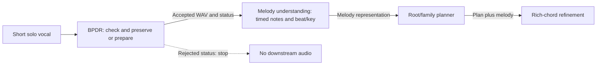

# P0 scope, claims, contract and open decisions

**Owner:** Liyanage L. N. P., IT23141506  
**Original P0 target:** 27–28 September 2026  
**Inspected status:** 30 September 2026  
**PP1 deadline supplied by user:** 25 October 2026

This is the local BPDR baseline for the PP1 experiment, grounded in the [master plan](PP1_Master_Plan.md), the supplied individual/team proposals and the implemented [`ProcessingResult` contract](../src/bpdr_input/contracts.py). It records the proposed team boundary; it is **not** a teammate-approved integration agreement.

## Problem, gap and claim boundary

| Item | Statement | Evidence status at this snapshot |
|---|---|---|
| User problem | A short solo vocal can carry a useful melody despite small pitch mistakes or uncertain note transitions; preparation should retain acceptable performance and timing. | Phase 1 demonstrates technical preservation, not musical-usability accuracy. |
| Technical problem | A false split or merge changes a boundary representation while leaving the waveform unchanged; a repair model may respond incorrectly to that metadata change. | Phase 2 produces verified same-waveform A/B and C/D laboratory pairs. |
| Bounded gap | It remains unestablished whether minimal repair can resist split/merge corruption **and** respond to small local detuning while preserving acceptable singing. | No trained comparative result exists. |
| Proposed novelty | Train a correction response using boundary invariance, local counter-detuning and zero-change preservation anchors together. | Proposed objective only; implementation and benefit remain Phase 3–5 work. |
| Claim test | Compare BPDR against same-data augmentation-only and frame-only learned controls on reviewed, singer-separated material, with repair error, preservation and coverage measured together. | Human approvals, checkpoints and independent results are pending. |

BERT-APC already examines displacement of existing boundaries. The proposed distinction is explicit split/merge intervention plus its paired correction-response objective; do not claim that earlier work ignored segmentation uncertainty. A flat zero-correction response is not success merely because it is boundary-invariant. See the [master plan](PP1_Master_Plan.md) for source pages and the complete comparison protocol.

## Input and output scope

- **Input accepted for technical assessment:** a 0.25–20-second WAV/FLAC, mono or stereo, intended as solo singing or humming. The software does not yet verify solo-vocal identity or musical suitability. No intended notes, key or genre are required for BPDR's first-version input.
- **Current output:** original bytes and SHA-256 retained separately; checked mono 22,050 Hz PCM24 working WAV with source time origin, rests and duration preserved within one target-rate sample; measured acoustics, diagnostics, plot and playback. `ACCEPT_UNCHANGED` means no musical correction, although channel selection/resampling/encoding may occur.
- **Future output:** `ACCEPT_PREPARED` only after the bounded repair controller, renderer, remeasurement and rollback checks exist. A musical repair, denoising benefit, intended-note inference and downstream accuracy are not current outputs.
- **Out of the PP1 prototype:** long-recording auto-truncation, rhythm replacement, multisinger separation, cloud deployment, accounts and the older post-generation harmony critic. Long source recordings enter the research laboratory only as explicitly mapped <=20-second crops.

## Proposed ownership and hand-off

This is the proposed PP1 sequence; only BPDR's technical unchanged/rejection paths are currently verified.

| Component | Proposed responsibility and data boundary | Current confirmation |
|---|---|---|
| BPDR input validation and minimal repair — IT23141506 | Own recording integrity, original retention, accepted/rejected status, checked prepared-or-unchanged WAV, operation provenance and seconds-based edit intervals. | Phase 1 technical unchanged/rejection paths verified; repair pending. |
| Melody understanding — IT23439078 | Consume **validated accepted audio** and produce timed melody/beat/key/phrase representation; map internal windows back to the accepted waveform's origin. | Proposed interface only; no live adapter verified. |
| Root/family planning — IT23148086 | Consume the melody representation and produce key-relative root/family plan. No direct dependency on BPDR acoustic feature arrays. | Proposed interface only; no live adapter verified. |
| Rich-chord refinement — IT23157132 | Consume aligned melody and root/family plan; keep agreed timing/root/family constraints in the PP1 path. | Proposed interface only; no live adapter verified. |

The provisional hand-off is [`ProcessingResult`](../src/bpdr_input/contracts.py) schema `0.1`. It carries request/source IDs, one of four statuses, optional `AcceptedAudio` path/SHA-256/sample rate/sample count/mono channel count, reason codes, user message and policy version. `ACCEPT_UNCHANGED` and future `ACCEPT_PREPARED` require `accepted_audio`; `RERECORD_REQUIRED` and `TECHNICAL_FAILURE` require a reason and **must not** expose an accepted-audio path. The consumer calls `require_accepted_audio` and the producing package's `validate_package` before reading the file. Operations, source hash, analyzer version, empty/current edit intervals and technical observations are recorded separately in per-run `diagnostics.json` schema `0.2`.

Two real saved contract examples from the [Phase 1 verification](Phase1_Verification.md) clarify the behavior; output files live in ignored `runs/`, so regenerate them on another machine:

| Saved run | Key fields in `result` | Downstream meaning |
|---|---|---|
| `fbedcabc9c5d46899eacfe86d29e74d9`, `vocadito_10.wav` | `ACCEPT_UNCHANGED`; mono 22,050 Hz; 200,607 samples; accepted WAV SHA-256 `54ac34e83c1dc6e8b800652a6d2ac40c03b65ecfca073e2dcfe13615bda4a8dc`; policy `phase1-technical-0.1`. | File-level validator passes; extractor may consume the accepted WAV. This does **not** assert that the singing is musically correct. |
| `93675e3bae0842288219d133e2993834`, `vocadito_1.wav` | `RERECORD_REQUIRED`; `accepted_audio=null`; reason `DURATION_OUT_OF_SCOPE`; policy `phase1-technical-0.1`. | Extractor must stop. The original was not silently cropped. |

No teammate acknowledgment of the exact schema, beat/seconds mapping, window-origin rule or playback/export owner was found in the inspected component evidence. Fixture-backed arrows can test integration mechanics but do not prove a live team model.

## Resources and dated milestone register

| Resource or milestone | Verified state | Open point |
|---|---|---|
| Source and runtime | Component in `experiments/bpdr_input`; Windows/Python 3.12.14/CPU Phase 1 run; component-local uv lock; frozen PESTO checkpoint identified by hash in diagnostics. | Sustained model-training compute and GPU availability not recorded. |
| Dataset | External read-only vocadito: 40 WAVs, 29 singers, F0 plus A1/A2 annotations; 38 sources yield 57 mapped crops after two annotation-bounds exclusions. | Redistribution/license terms not recorded; keep raw/generated audio untracked until resolved. |
| 27–28 Sep, P0 target | Research question, local scope, draft contract, data/resource inventory and milestone baseline consolidated here on 30 Sep. | Team agreement and named ownership decisions remain open. |
| 29–30 Sep, P1 target | Technical acceptance/failure path and frozen acoustic analysis verified in [Phase 1 evidence](Phase1_Verification.md). | Musical-usability validation and prepared repair remain open. |
| 1–4 Oct, P2 target | Source splits/crops, review sheets and one-singer exploratory four-view pilot execute early; 114 review rows pending, zero training eligible. | Two independent reviewer decisions, multi-singer approved anchors and audit-passing reviewed collection are required for the research gate. |
| 5–25 Oct, P3–P6 targets | Baselines, BPDR repair, independent comparison, team adapter and PP1 rehearsal are planned in the [phase plan](PP1_Phase_Execution_Plan.md). | No trained-model or presentation-completion credit without saved acceptance evidence. |

The proposal's W1–W8 planning weights total 640 hours; neither those estimates nor this milestone table measure actual hours or an official completion percentage. See the [evidence tracker](PP1_Evidence_Tracker.md).

## Decisions still requiring real evidence

1. **Team interface and ownership:** obtain melody-owner agreement on the accepted-WAV schema, timing origin, silence-window mapping and who owns playback/export; resolve the older accompaniment-member wording in the proposals. Until then, the table above is a proposed boundary only.
2. **Human references:** two distinct musically experienced reviewers must make independent decisions with crop-local approved intervals. The [review guide](Reference_Review_Guide.md) and pending sheets exist; no approval may be inferred from A1/A2 or automatic pitch agreement.
3. **Data permissions:** identify and record the source dataset's actual license and any approval needed before distributing original/derived audio or public PP1 assets. No permission is assumed by successful local processing.
4. **Scientific bridge:** current laboratory boundary tracks come from A1 annotation onsets and offsets, while runtime emits an audio-derived provisional score. Evaluate those conditions separately before claiming real-input boundary robustness.
5. **Presentation operations:** confirm the official PP1 slot, demonstration hardware and rehearsal playback; until measured, compute latency and user/commercial benefit are hypotheses.

**P0 gate:** the local problem, comparative question, scope, draft interface and baseline are now explicit enough for independent BPDR development. Cross-component agreement, reviewer approval, permissions and eventual PP1 readiness remain open gates.
